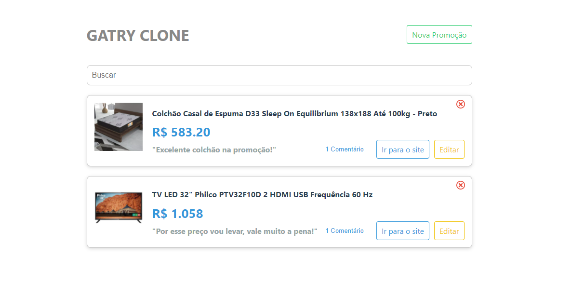

# Gatry Clone
Este projeto é um clone do site Gatry, podendo registrar, editar e excluir promoções, assim como no site original.

## Indíce
- [Gatry Clone](#gatry-clone)
  - [Indíce](#indíce)
  - [Introdução](#introdução)
  - [Screenshots](#screenshots)
  - [Tecnologias](#tecnologias)
  - [Instalação](#instalação)
  - [Referências](#referências)
  - [Contato](#contato)

## Introdução
Inicialmente, este projeto realizado, originou-se da playlist do Vinicius Dacal, React para Iniciantes. Na playlist, são apresentados fundamentos do React JS, desenvolvendo um clone do siteb Gatry.

Este projeto, apresenta algumas modificações em comparação ao original que é proposto no tutorial. Uma diferença a ser citada, é o uso de Lottie, uma ferramenta em ofertar animações para a aplicação.

## Screenshots

## Tecnologias
* React JS
* JSON Server
* Lottie
* Formik

## Instalação
Os passo a seguir, são referentes em como instalar o projeto.

$ git clone https://github.com/Alfredo-Paes/ 

$ cd  my_gatry_clone

$ cd api

$ npm install 

$ npm start

$ cd web

$ npm install

$ npm start
## Referências
https://gatry.com/

https://pt-br.reactjs.org/

https://www.npmjs.com/package/json-server
 
https://lottiefiles.com/

https://dev.to/proiacm/lottie-animations-for-react-1c9l

https://formik.org/

https://getavataaars.com/

https://www.youtube.com/watch?v=4juIVSWo-pw&list=PLv2oOZboUtKMMszyFDrMz-cVs4pKqDssM

## Contato
alfredo.alfpaes@gmail.com - Sinta-se livre para entrar em contato!
